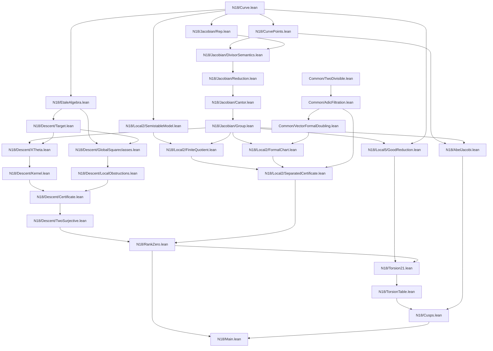

ANSWER Q4266 0217010d

# Bottom-up Lean build order for the fixed \(X_1(18)\) genus-2 descent

## Executive verdict

This is **closable without Mordell–Weil finite generation**, but it is a project-scale formalization, not a short patch. The smallest credible architecture has four independent spines that meet only near the end:

1. **Jacobian computation spine:** fixed sextic, balanced Mumford normal forms, generalized Cantor arithmetic, and a proved additive group.
2. **2-descent spine:** the full even-degree \(x-\theta\) Kummer map, a fixed finite squareclass certificate, and the theorem that its kernel is \(2J\).
3. **2-adic separatedness spine:** a reusable abstract filtration theorem plus the fixed bad-reduction local certificate at \(2\), with exponent \(e=21\).
4. **torsion/cusp spine:** a certified \(J(\mathbf Q)\cong\mathbf Z/21\mathbf Z\), a table of the 21 balanced classes, and Abel–Jacobi inspection yielding the six rational cusps.

The final rank-zero argument is tiny once the two middle outputs exist:

\[
\text{descent certificate}
\Longrightarrow J(\mathbf Q)=2J(\mathbf Q)
\Longrightarrow 21J(\mathbf Q)=0
\Longrightarrow \operatorname{rank}J(\mathbf Q)=0.
\]

No `Module.Finite ℤ J`, Mordell–Weil theorem, canonical height, Northcott theorem, or general Selmer/cohomology library is required.

The architecture should **not** implement a general genus-\(g\) Jacobian, a Picard scheme, a general Néron model, or a general 2-Selmer package. It should prove reusable algebraic lemmas where they are genuinely small, but keep all geometric and arithmetic objects fixed to this curve.

---

# 1. Dependency DAG



The critical path is

```text
Curve
→ balanced Mumford semantics
→ Cantor correctness / AddCommGroup
→ full x−θ kernel theorem
→ finite descent certificate
→ two-surjectivity
→ local 2-adic certificate
→ bounded exponent 21
→ torsion table
→ six cusps.
```

The global squareclass computation and the local-at-\(2\) computation can proceed in parallel once the curve and the public Jacobian API stabilize.

---

# 2. Classification key and rough size

The estimates below are **Lean source lines**, including declarations and proofs but excluding generated numeric tables.

- **Ready:** ordinary Mathlib algebra, polynomial arithmetic, quotients, finite fields, `ZMod`, matrices, ideals, and \(p\)-adics.
- **Finite:** theorem is mathematical infrastructure already available; the fixed proof is mostly `ring`, `norm_num`, exact matrix arithmetic, `native_decide`, or checking displayed certificates.
- **Moderate-new:** a reusable but contained theorem absent from Mathlib.
- **Hard-new:** genuinely new genus-2 arithmetic or local geometry.

| Module | Main output | Type | Rough size |
|---|---|---:|---:|
| `Common/TwoDivisible` | repeated halving and bounded-exponent lemma | Ready | 80–180 |
| `Common/AdicFiltration` | abstract separated-filtration theorem | Ready/moderate | 120–250 |
| `Common/VectorFormalDoubling` | dimension-independent \(p\)-adic doubling estimate | Moderate-new | 250–700 |
| `N18/Curve` | fixed sextic, smoothness, two infinities | Finite | 150–350 |
| `N18/EtaleAlgebra` | \(L=\mathbf Q[T]/(f)\), basis, norm interfaces | Finite/moderate | 350–900 |
| `N18/CurvePoints` | custom affine/\(\infty^\pm\) point type | Ready | 100–250 |
| `Jacobian/Rep` | balanced generalized Mumford records | Moderate-new | 250–600 |
| `Jacobian/DivisorSemantics` | private divisor-class meaning | Hard-new | 900–2200 |
| `Jacobian/Reduction` | balanced reduction, termination, uniqueness | Hard-new | 800–1800 |
| `Jacobian/Cantor` | composition/negation and semantic correctness | Hard-new | 1200–3000 |
| `Jacobian/Group` | `AddCommGroup`, extensionality, computable equality | Moderate-new | 400–1000 |
| `Descent/Target` | full norm-pair and fake targets | Moderate-new | 300–750 |
| `Descent/XTheta` | \(u(\theta)\) map and homomorphism | Hard-new | 700–1700 |
| `Descent/Kernel` | `ker δ = 2J` for the sextic | **Hardest** | 1800–4500 |
| `Descent/GlobalSquareclasses` | finite \(S\)-squareclass candidates | Finite/moderate | 1000–3000 + data |
| `Descent/LocalObstructions` | per-candidate local exclusions | Finite | 700–2200 + data |
| `Descent/Certificate` | candidate completeness + only zero survives | Mostly glue | 200–500 |
| `Descent/TwoSurjective` | `∀ P, ∃ Q, 2 • Q = P` | Ready | 80–180 |
| `Local2/SemistableModel` | theta graph special fibre | Finite | 250–650 |
| `Local2/FiniteQuotient` | \(J(\mathbf Q_2)/J_1\cong\mathbf Z/21\) | Moderate/hard-new | 700–1800 |
| `Local2/FormalChart` | two coordinates and duplication formula | Hard-new | 900–2500 |
| `Local2/SeparatedCertificate` | `21J(Q₂)⊂U₀`, `2U_n⊂U_{n+1}`, separation | Glue/moderate | 200–600 |
| `RankZero` | `21 • P = 0` and rationalized rank zero | Ready | 100–250 |
| `Local5/GoodReduction` | finite reduction group of order 21 | Finite/moderate | 500–1200 |
| `Torsion21` | \(J(\mathbf Q)\cong\mathbf Z/21\) | Moderate | 300–800 |
| `TorsionTable` | list and verify 21 classes | Finite | 300–900 + table |
| `AbelJacobi` | point-to-class map and injectivity | Moderate-new | 300–900 |
| `Cusps` | exactly six rational points | Finite/glue | 200–500 |

A realistic total is approximately **14,000–30,000 lines**, depending mainly on how much divisor semantics and local formal-coordinate algebra can be shared with other projects. The finite certificate tables may add substantial data but little conceptual proof code.

---

# 3. Stage 0: reusable MW-FG-free algebra

Build this first, before any genus-2 code. It is useful immediately for N15/N21 and later for N18.

## 3.1 Two-divisibility

```lean
namespace TwoDivisible

variable {G : Type*} [AddCommGroup G]

def SurjectiveTwo : Prop :=
  ∀ x : G, ∃ y : G, 2 • y = x

lemma pow_two_root (h : SurjectiveTwo (G := G))
    (x : G) (n : ℕ) : ∃ y : G, (2 ^ n) • y = x := by
  sorry

end TwoDivisible
```

This is pure induction and additive-group algebra.

## 3.2 Abstract filtration theorem

```lean
namespace AdicSeparated

variable {G H : Type*} [AddCommGroup G] [AddCommGroup H]

structure Certificate where
  loc : G →+ H
  loc_injective : Function.Injective loc
  level : ℕ → AddSubgroup H
  exponent : ℕ
  exponent_ne_zero : exponent ≠ 0
  enter : ∀ x : G, exponent • loc x ∈ level 0
  double_step : ∀ n z, z ∈ level n → 2 • z ∈ level (n + 1)
  separated : ∀ z, (∀ n, z ∈ level n) → z = 0

lemma pow_two_mem_level (C : Certificate (G := G) (H := H))
    {z : H} (hz : z ∈ C.level 0) :
    ∀ n, (2 ^ n) • z ∈ C.level n := by
  sorry

theorem exponent_kills_of_two_surjective
    (C : Certificate (G := G) (H := H))
    (h2 : TwoDivisible.SurjectiveTwo (G := G)) :
    ∀ x : G, C.exponent • x = 0 := by
  sorry

end AdicSeparated
```

This theorem is the entire MW-FG-free replacement. It is dimension-free and knows nothing about elliptic curves, Jacobians, local fields, or formal groups.

## 3.3 Rank-zero without finite generation

Use a project-level rank-zero predicate that is equivalent to vanishing after rationalization:

```lean
def BoundedExponent (G : Type*) [AddCommGroup G] : Prop :=
  ∃ e : ℕ, e ≠ 0 ∧ ∀ x : G, e • x = 0

/-- No finite-generation hypothesis. -/
theorem rationalization_subsingleton_of_boundedExponent
    {G : Type*} [AddCommGroup G]
    (h : BoundedExponent G) :
    Subsingleton (TensorProduct ℤ ℚ G) := by
  sorry
```

The exact tensor-product argument may use the preferred Mathlib orientation of scalar restriction. The proof is elementary: the nonzero integer \(e\) becomes invertible over \(\mathbf Q\).

---

# 4. Stage 1: a shared vector-valued formal-doubling lemma

Mathlib currently has a one-dimensional `FormalGroup`; it does not provide the required two-dimensional formal group of an abelian surface. Do **not** first build a general multidimensional formal-group library. The rank proof only needs a coordinate valuation estimate.

Use a dimension-parameterized local chart whose nonlinear error is known to be quadratic.

```lean
namespace VectorFormalDoubling

variable {ι R : Type*} [Fintype ι] [CommRing R]

/-- Sufficient data for the filtration argument; no associativity axiom. -/
structure ChartData where
  point : Type*
  zero : point
  dbl : point → point
  coord : point → (ι → R)
  coord_injective_at_zero :
    ∀ z, (∀ i, coord z i = 0) → z = zero

  err : point → (ι → R)
  coord_dbl :
    ∀ z i, coord (dbl z) i = 2 * coord z i + err z i

/-- Specialize this predicate to `R = ℤ_[2]`. -/
def AtLevel (C : ChartData (ι := ι) (R := R))
    (n : ℕ) (z : C.point) : Prop :=
  ∀ i, coord C z i ∈ Ideal.span ({(2 : R) ^ (n + 1)} : Set R)

end VectorFormalDoubling
```

The useful theorem should consume a direct quadratic divisibility bound rather than formal power-series coefficients:

```lean
theorem double_moves_one_level
    (C : ChartData (ι := ι) (R := ℤ_[2]))
    (hquad : ∀ n z, C.AtLevel n z →
      ∀ i, C.err z i ∈
        Ideal.span ({(2 : ℤ_[2]) ^ (n + 2)} : Set ℤ_[2])) :
    ∀ n z, C.AtLevel n z → C.AtLevel (n + 1) (C.dbl z) := by
  sorry
```

The proof is coordinatewise. It is **the same proof** for:

- N15/N21 elliptic curves: `ι = Fin 1`;
- N18 Jacobian: `ι = Fin 2`.

For an actual integral formal group law,

\[
[2](z)=2z+H(z),\qquad H\in(z_1,\ldots,z_d)^2,
\]

`hquad` follows because \(z_i\in2^{n+1}\mathbf Z_2\) makes every monomial of degree at least two divisible by \(2^{2n+2}\), hence by \(2^{n+2}\).

**What is shared:** filtration induction, valuation arithmetic, and separatedness.

**What is not shared:** constructing the chart and proving the displayed duplication formula has integral coefficients. That remains curve-specific.

---

# 5. Stage 2: fixed curve and étale algebra

## 5.1 Curve

```lean
namespace N18

open Polynomial

def f : ℚ[X] :=
  X^6 + 4*X^5 + 10*X^4 + 10*X^3 + 5*X^2 + 2*X + 1

lemma f_monic : f.Monic := by norm_num [f]
lemma f_degree : f.natDegree = 6 := by norm_num [f]

/-- Use a displayed Bézout identity for `f` and `f.derivative`. -/
lemma f_squarefree : f.Squarefree := by
  sorry

/-- Prefer a finite irreducibility certificate modulo one prime. -/
lemma f_irreducible : Irreducible f := by
  sorry

end N18
```

Do not invoke a general factorization oracle. Store the reduction prime and a finite no-factor certificate. Degree six requires excluding factors of degrees \(1,2,3\), all decidable over a small `ZMod p`.

## 5.2 Custom points

```lean
inductive N18.Point
  | affine (x y : ℚ) (onCurve : y^2 = N18.f.eval x)
  | infinityPlus
  | infinityMinus
```

This is enough for Abel–Jacobi and the final rational-point theorem. A projective scheme is unnecessary.

## 5.3 Étale algebra/field

```lean
abbrev N18.L := AdjoinRoot N18.f

def N18.theta : N18.L := AdjoinRoot.root N18.f

noncomputable instance : Field N18.L :=
  AdjoinRoot.instFieldOfIrreducible N18.f_irreducible

noncomputable instance : NumberField N18.L := by
  infer_instance
```

Add only the exact arithmetic interfaces needed by the certificate:

- power basis \(1,\theta,\ldots,\theta^5\);
- multiplication matrices;
- field norm;
- a certified integral basis;
- factorization of the finitely many ideals above the selected \(S\)-primes;
- maps to the finitely many residue rings/local squareclass test rings.

Do not build a general computational number-field package.

---

# 6. Stage 3: balanced Mumford Jacobian

## 6.1 Representation

Choose \(\infty^-\) as base point. A class is represented by

\[
D(u,v,n)=D_{\rm aff}(u,v)+n\infty^+-(\deg u+n)\infty^-,
\qquad \deg u+n\le2.
\]

```lean
structure N18.MumfordRep (K : Type*) [Field K] where
  u : K[X]
  v : K[X]
  nInf : ℕ
  u_monic : u.Monic
  v_reduced : v % u = v
  curve_dvd : u ∣ N18.f.map (algebraMap ℚ K) - v^2
  degree_bound : u.natDegree + nInf ≤ 2
```

The public type should eventually have decidable equality whenever the coefficient field does.

## 6.2 Private semantic layer

The safest route is:

1. define a small semantic degree-zero divisor group for the fixed hyperelliptic function field;
2. quotient by principal divisors;
3. map a Mumford representative to its divisor class;
4. prove every class has a balanced representative;
5. prove the representative is unique;
6. transport the quotient group law to balanced representatives.

This avoids proving associativity by expanding all branches of Cantor addition.

Suggested signatures:

```lean
namespace N18.Jacobian

private def Divisor0 (K : Type*) [Field K] := sorry
private def Principal : AddSubgroup (Divisor0 K) := sorry
private abbrev Class (K : Type*) [Field K] := Divisor0 K ⧸ Principal

private def represent : N18.MumfordRep K → Class K := sorry

noncomputable def reduce : Class K → N18.MumfordRep K := sorry

lemma represent_reduce (D : Class K) : represent (reduce D) = D := by
  sorry

lemma reduce_represent (D : N18.MumfordRep K) : reduce (represent D) = D := by
  sorry

end N18.Jacobian
```

The semantic layer need not support arbitrary algebraic curves. It only needs valuations/principal-divisor identities for functions of the form \(a(x)+b(x)y\) that occur in generalized Cantor composition and reduction.

## 6.3 Cantor arithmetic

Implement composition and reduction as executable functions, then prove they agree with the semantic quotient operation.

```lean
noncomputable def N18.Jacobian.addRep
    (D E : N18.MumfordRep K) : N18.MumfordRep K := sorry

noncomputable def N18.Jacobian.negRep
    (D : N18.MumfordRep K) : N18.MumfordRep K := sorry

lemma represent_addRep (D E : N18.MumfordRep K) :
    represent (addRep D E) = represent D + represent E := by
  sorry

lemma represent_negRep (D : N18.MumfordRep K) :
    represent (negRep D) = -represent D := by
  sorry
```

Then transport the group:

```lean
abbrev N18.J (K : Type*) [Field K] := N18.MumfordRep K

noncomputable instance : AddCommGroup (N18.J K) :=
  Equiv.addCommGroup
    { toFun := N18.Jacobian.represent
      invFun := N18.Jacobian.reduce
      left_inv := N18.Jacobian.reduce_represent
      right_inv := N18.Jacobian.represent_reduce }
```

Exact helper names will differ, but the principle matters: group laws come from the semantic quotient, while computation comes from Cantor formulas.

## 6.4 Ruthless scope control

Do not implement:

- arbitrary genus;
- arbitrary \(y^2+h(x)y=f(x)\) models at this stage;
- Kummer surfaces;
- a Picard functor or Picard scheme;
- divisor theory at arbitrary non-rational closed points beyond what the fixed formulas require;
- generic fast Cantor arithmetic.

A fixed monic sextic with two rational infinity points is enough.

---

# 7. Stage 4: the full even-degree descent map

## 7.1 Do not use only the fake target

For a degree-six model, \(L^*/(L^{*2}\mathbf Q^*)\) has the familiar infinity ambiguity. The exact kernel theorem should use the **full norm-pair target**.

```lean
structure N18.Descent.NormPair where
  alpha : N18.Lˣ
  scalar : ℚˣ
  norm_eq : Algebra.norm ℚ (alpha : N18.L) = (scalar : ℚ)^2
```

Quotient by

\[
(\alpha,s)\sim
(\alpha\beta^2q,\;s\,N(\beta)q^3),
\qquad \beta\in L^*,\ q\in\mathbf Q^*.
\]

Expose:

```lean
abbrev N18.Descent.FullTarget := sorry
abbrev N18.Descent.FakeTarget :=
  Additive (N18.Lˣ ⧸ (squares ⊔ rationalScalars))

def N18.Descent.forget : FullTarget →+ FakeTarget := sorry
```

The fixed computational certificate may mostly work in the fake target, but it must carry the extra norm/infinity bit and prove that it also vanishes.

## 7.2 \(x-\theta\) map

For \(D=(u,v,n)\), the fake component is the class of \(u(\theta)\). First prove it is nonzero:

```lean
lemma aeval_theta_u_ne_zero (D : N18.J ℚ) :
    Polynomial.aeval N18.theta D.u ≠ 0 := by
  -- `f` irreducible of degree 6, while `deg u ≤ 2`.
  sorry
```

Then define:

```lean
def N18.Descent.delta : N18.J ℚ →+ N18.Descent.FullTarget := sorry
```

The homomorphism theorem is proved by applying the Cantor composition identity at \(x=\theta\): the extra factors are squares and rational scalars.

## 7.3 The hardest theorem

```lean
theorem N18.Descent.ker_delta_eq_doubleRange :
    N18.Descent.delta.ker =
      (2 • AddMonoidHom.id (N18.J ℚ)).range := by
  sorry
```

Equivalently:

```lean
abbrev N18.ModTwo :=
  (N18.J ℚ) ⧸ (2 • AddMonoidHom.id (N18.J ℚ)).range

def N18.Descent.deltaModTwo :
    N18.ModTwo →+ N18.Descent.FullTarget := sorry

theorem N18.Descent.deltaModTwo_injective :
    Function.Injective N18.Descent.deltaModTwo := by
  sorry
```

This is the **single hardest lemma in the entire build**. It does not reduce to the \(2\)-adic formal-group estimate. It is an algebraic-geometric halving theorem:

> if the full \(x-\theta\) class of a balanced divisor is trivial, construct a divisor class whose double is the original class.

For the fixed curve, specialize the standard proof and express every step through polynomial gcds, norm identities, and Cantor reduction. Avoid first proving a theorem for all hyperelliptic curves.

A productive decomposition is:

```text
full class trivial
→ choose β,q with u(θ)=β²q and matching norm bit
→ lift β to a degree < 6 polynomial b(T)
→ derive a polynomial identity modulo f
→ construct a semireduced divisor Q
→ Cantor-double Q
→ normalize
→ obtain D.
```

Most terminal identities are `ring`; the hard part is setting up the correct polynomial objects and degree/gcd arguments.

---

# 8. Stage 5: finite 2-descent certificate, without a Selmer library

The minimum fixed-instance architecture need not define Galois cohomology or an abstract `SelmerGroup`.

It is enough to prove:

```lean
theorem delta_image_trivial :
  ∀ P : N18.J ℚ, N18.Descent.delta P = 0
```

Together with `ker_delta_eq_doubleRange`, this directly gives `J(\mathbf Q)=2J(\mathbf Q)`.

## 8.1 Certificate structure

```lean
structure N18TwoDescentCertificate where
  /- Exact arithmetic model of L. -/
  integralBasis : Basis (Fin 6) ℤ (𝓞 N18.L)
  basis_correct : sorry

  /- Finite set S containing archimedean, 2, discriminant, and model primes. -/
  S : Finset N18.PrimeCode
  S_complete : sorry

  /- Finite F₂ vector representation of admissible global squareclasses. -/
  ambient : Type*
  instFintypeAmbient : Fintype ambient
  instDecEqAmbient : DecidableEq ambient
  candidates : Finset ambient

  global_complete :
    ∀ P : N18.J ℚ,
      N18.Descent.encode (N18.Descent.delta P) ∈ candidates

  zeroCode : ambient
  zero_mem : zeroCode ∈ candidates

  /- Every nonzero candidate has a certified local obstruction. -/
  obstruction :
    ∀ c, c ∈ candidates → c ≠ zeroCode →
      N18.Descent.LocalObstruction c

  obstruction_sound :
    ∀ c, N18.Descent.LocalObstruction c →
      c ∉ N18.Descent.localKummerImage
```

In practice, avoid storing arbitrary proofs in a giant record if it harms reduction. Split data and soundness theorems:

```lean
structure N18TwoDescentData where ...

theorem N18TwoDescentData.sound
    (D : N18TwoDescentData) :
    ∀ P, N18.Descent.delta P = 0 := by
  ...
```

## 8.2 Finite arithmetic checks

Mathlib already supplies the raw algebraic types. The project supplies explicit certificates for:

- integral basis multiplication table;
- discriminant/index check;
- ideals over \(S\);
- parity of valuations outside \(S\);
- \(S\)-unit generators modulo squares;
- class-group \(2\)-part information actually needed by the candidate completeness theorem;
- norm condition;
- local squareclass images at the finite list of places;
- per-candidate contradiction in a finite quotient \(\mathbf Z/2^m\mathbf Z\), residue field, or short valuation computation.

Do not formalize generic class-group, \(S\)-unit, or local-solubility algorithms. Verify their fixed output.

## 8.3 Output theorem

```lean
theorem N18.two_surjective
    (cert : N18TwoDescentData) :
    ∀ P : N18.J ℚ, ∃ Q : N18.J ℚ, 2 • Q = P := by
  intro P
  have hδ : N18.Descent.delta P = 0 := cert.sound P
  rw [← N18.Descent.mem_ker_delta, N18.Descent.ker_delta_eq_doubleRange] at hδ
  exact hδ
```

No rank formula and no finite generation occurs here.

---

# 9. Stage 6: local bad-reduction certificate at \(2\)

## 9.1 Semistable model: finite checks

Use the integral model

\[
y^2+(x^3+x+1)y=x^5+2x^4+2x^3+x^2.
\]

Set \(g=x^2+x+1\), \(u=y+g\). Verify

\[
f-g^2+hg=2x^3g,
\qquad
u(u+h)=2g(u+x^3).
\]

Modulo \(2\), the two components \(u=0\) and \(u+h=0\) meet in the degree-three point cut out by \(h=x^3+x+1\). The finite module proves:

```lean
lemma h_mod2_irreducible :
    Irreducible (X^3 + X + 1 : (ZMod 2)[X]) := by native_decide

lemma node_transverse :
    IsCoprime (X^3 + X + 1 : (ZMod 2)[X])
      ((X^2 + X + 1) * X) := by native_decide
```

The dual graph is the two-vertex theta graph with Frobenius cycling its three edges.

## 9.2 Fixed Néron quotient theorem

Do not build a general Néron model. Prove one specialized bridge from this certified semistable model to a finite quotient code.

Required result:

\[
\Phi_2(\mathbf F_2)\cong\mathbf Z/3,
\qquad
\mathcal J^0_{\mathbf F_2}(\mathbf F_2)
  \cong \mathbf F_8^*/\mathbf F_2^*
  \cong\mathbf Z/7.
\]

Hence

\[
J(\mathbf Q_2)/J_1(\mathbf Q_2)\cong\mathbf Z/21.
\]

The finite calculations are tiny:

- reduced graph Laplacian is `(3)`;
- Smith normal form gives \(\mathbf Z/3\);
- the identity torus is \((\operatorname{Res}_{\mathbf F_8/\mathbf F_2}\mathbf G_m)/\mathbf G_m\);
- its point count is \(7\), equivalently `det (2I - Frob) = 7` on the augmentation lattice.

The new infrastructure is the theorem connecting the fixed semistable curve data to these two groups. Package only its consequence:

```lean
structure N18.Local2.FiniteQuotientCertificate where
  Q : Type*
  instAddCommGroupQ : AddCommGroup Q
  instFintypeQ : Fintype Q
  red : N18.J ℚ_[2] →+ Q
  equivZMod21 : Q ≃+ ZMod 21
  kernel_is_formal : red.ker = N18.Local2.formalKernel
```

Then:

```lean
lemma twentyOne_enters_formal
    (P : N18.J ℚ_[2]) :
    21 • P ∈ N18.Local2.formalKernel := by
  ...
```

This is the only place where bad reduction changes the elliptic-style proof.

## 9.3 Two-dimensional formal chart

Do not require a general formal completion object. Supply explicit coordinates on the kernel:

```lean
structure N18.Local2.FormalChart where
  coord : N18.Local2.formalKernel → Fin 2 → ℤ_[2]
  coord_mem_two : ∀ P i, coord P i ∈ Ideal.span ({2} : Set ℤ_[2])
  coord_zero_iff : ∀ P, (∀ i, coord P i = 0) ↔ P = 0

  err : N18.Local2.formalKernel → Fin 2 → ℤ_[2]
  coord_double :
    ∀ P i, coord (2 • P) i = 2 * coord P i + err P i

  err_quadratic :
    ∀ n P,
      (∀ i, coord P i ∈
        Ideal.span ({(2 : ℤ_[2])^(n+1)} : Set ℤ_[2])) →
      ∀ i, err P i ∈
        Ideal.span ({(2 : ℤ_[2])^(n+2)} : Set ℤ_[2])
```

Instantiate the shared `VectorFormalDoubling` theorem with `Fin 2`.

Define

```lean
def N18.Local2.U (n : ℕ) : AddSubgroup (N18.J ℚ_[2]) :=
  { P ∈ formalKernel |
      ∀ i, chart.coord P i ∈
        Ideal.span ({(2 : ℤ_[2])^(n+1)} : Set ℤ_[2]) }
```

and obtain:

```lean
lemma double_U (n : ℕ) :
  ∀ P, P ∈ U n → 2 • P ∈ U (n+1) := by
  exact VectorFormalDoubling.double_moves_one_level ...

lemma iInf_U_eq_bot :
  ⨅ n, U n = ⊥ := by
  -- coordinatewise `⋂ 2^(n+1) ℤ₂ = 0`, then `coord_zero_iff`.
  sorry
```

## 9.4 Local certificate output

```lean
def N18.localSeparatedCertificate :
    AdicSeparated.Certificate
      (G := N18.J ℚ) (H := N18.J ℚ_[2]) where
  loc := N18.baseChangeToQ2
  loc_injective := N18.baseChangeToQ2_injective
  level := N18.Local2.U
  exponent := 21
  exponent_ne_zero := by norm_num
  enter := by
    intro P
    exact N18.Local2.twentyOne_enters_formal (N18.baseChangeToQ2 P)
  double_step := N18.Local2.double_U
  separated := N18.Local2.separated
```

---

# 10. Stage 7: rank zero

The final theorem is now a few lines:

```lean
theorem N18.twentyOne_smul_eq_zero
    (descent : N18TwoDescentData) :
    ∀ P : N18.J ℚ, 21 • P = 0 := by
  exact AdicSeparated.exponent_kills_of_two_surjective
    N18.localSeparatedCertificate
    (N18.two_surjective descent)

 theorem N18.rankZero
    (descent : N18TwoDescentData) :
    Subsingleton (TensorProduct ℤ ℚ (N18.J ℚ)) := by
  apply rationalization_subsingleton_of_boundedExponent
  exact ⟨21, by norm_num, N18.twentyOne_smul_eq_zero descent⟩
```

This is stronger than merely proving the rank is zero: it gives the uniform exponent \(21\) on all rational Jacobian points.

---

# 11. Stage 8: certify \(J(\mathbf Q)\cong\mathbf Z/21\)

The bounded-exponent theorem gives only exponent dividing \(21\). To enumerate all classes, certify that the group is exactly cyclic of order \(21\).

The smallest axiom-free route is good reduction at \(5\):

1. enumerate balanced Mumford classes over \(\mathbf F_5\);
2. verify by `native_decide` that the finite group has order \(21\) and is cyclic;
3. exhibit a rational class \(T\) whose reduction generates it;
4. prove reduction is injective on \(21\)-torsion because the formal kernel at \(5\) is pro-\(5\), and \(21\) is a \(5\)-adic unit.

```lean
def N18.T : N18.J ℚ := sorry

lemma T_order : AddOrderOf N18.T = 21 := by
  sorry

lemma reduction5_injective_of_21_killed
    {P Q : N18.J ℚ}
    (hP : 21 • P = 0) (hQ : 21 • Q = 0)
    (hred : reduce5 P = reduce5 Q) : P = Q := by
  sorry

 theorem N18.every_eq_mul_T
    (descent : N18TwoDescentData)
    (P : N18.J ℚ) :
    ∃! k : ZMod 21, k.val • N18.T = P := by
  sorry

noncomputable def N18.jacEquivZMod21
    (descent : N18TwoDescentData) :
    N18.J ℚ ≃+ ZMod 21 := sorry
```

This local good-reduction lemma can share a small generic fact with elliptic work: multiplication by an integer prime to \(p\) is injective on the \(p\)-adic formal kernel. It is separate from the \(2\)-adic doubling estimate.

---

# 12. Stage 9: Abel–Jacobi and the six cusps

## 12.1 Abel–Jacobi map

Base at \(\infty^-\):

```lean
def N18.abelJacobi : N18.Point → N18.J ℚ
  | .infinityMinus => 0
  | .infinityPlus  => N18.infinityDifference
  | .affine x y h  => N18.degreeOneRep x y h
```

Prove injectivity directly from balanced normal-form uniqueness. No general theorem about embeddings of curves into Jacobians is needed.

```lean
theorem N18.abelJacobi_injective :
    Function.Injective N18.abelJacobi := by
  intro P Q h
  cases P <;> cases Q
  · -- affine/affine: equality of `u = X-x` and `v = y`
    ...
  · -- infinity cases separated by `nInf`
    ...
```

## 12.2 Table of 21 classes

```lean
def N18.torsionTable (k : Fin 21) : N18.J ℚ :=
  k.val • N18.T

lemma torsionTable_nodup :
    Function.Injective N18.torsionTable := by
  sorry

lemma torsionTable_complete
    (descent : N18TwoDescentData) :
    ∀ P : N18.J ℚ, ∃ k, torsionTable k = P := by
  sorry
```

Store the 21 normalized triples `(u,v,nInf)` and verify each multiplication step with Cantor arithmetic. This is ideal `native_decide`/`norm_num` work once the operation is executable.

## 12.3 Detect point-shaped classes

A balanced class lies in the Abel–Jacobi image precisely when its normal form is one of:

- `u=1, nInf=0`: \(\infty^-\);
- `u=1, nInf=1`: \(\infty^+\);
- `deg u=1, nInf=0`: one affine rational point.

Inspect the 21-entry table. Exactly six classes have these shapes, corresponding to

\[
\infty^-,\quad \infty^+,\quad
(0,1),\quad(0,-1),\quad(-1,1),\quad(-1,-1).
\]

The curve checks are immediate:

```lean
example : N18.f.eval 0 = 1 := by norm_num [N18.f]
example : N18.f.eval (-1) = 1 := by norm_num [N18.f]
```

Final theorem:

```lean
def N18.cusps : Finset N18.Point :=
  { infinityMinus, infinityPlus,
    affine 0 1 ..., affine 0 (-1) ...,
    affine (-1) 1 ..., affine (-1) (-1) ... }

 theorem N18.rational_points_eq_cusps
    (descent : N18TwoDescentData) :
    ∀ P : N18.Point, P ∈ N18.cusps := by
  intro P
  obtain ⟨k, hk⟩ := N18.torsionTable_complete descent (N18.abelJacobi P)
  have hshape := N18.point_shaped_entries_exhaustive k hk
  exact N18.abelJacobi_injective (hshape P)
```

A more conventional statement can identify `Set.range N18.abelJacobi` or give equality with the six-element set.

---

# 13. Minimum genuinely new genus-2 infrastructure

Be ruthless. The following is the irreducible minimum.

## Must build

1. **Fixed balanced Mumford normal forms** for one monic sextic with two rational infinity points.
2. **A private semantic divisor-class layer** sufficient to prove Cantor correctness and normal-form uniqueness.
3. **Generalized Cantor composition and reduction** for this even-degree genus-2 model.
4. **The full even-degree \(x-\theta\) target and kernel theorem.**
5. **A fixed certificate checker** for the degree-six field and its selected local places.
6. **A fixed semistable-at-\(2\) to finite-quotient bridge** yielding exponent \(21\).
7. **A two-coordinate formal chart** with explicit duplication error bounds.
8. **A fixed Abel–Jacobi map** and table inspection.

## Explicitly do not build

- general Mordell–Weil finite generation;
- weak Mordell–Weil or heights;
- a general abelian-variety hierarchy;
- a general Jacobian/Picard scheme;
- a general Néron-model library;
- Galois cohomology or a generic Selmer group;
- a general number-field class-group or \(S\)-unit algorithm;
- general Coleman/Chabauty machinery;
- Kummer-surface coordinates, unless later wanted for independent purposes;
- generic genus-\(g\) Cantor arithmetic.

The fixed certificate may contain large explicit matrices and lists. That is preferable to proving broad algorithms that the final theorem does not use.

---

# 14. The hardest lemma and formal-group code sharing

## 14.1 Hardest overall

The hardest single lemma is

```lean
N18.Descent.ker_delta_eq_doubleRange
```

or equivalently `deltaModTwo_injective`.

Reasons:

- it must connect Mumford arithmetic to divisor-class halving;
- it must handle the two points at infinity correctly;
- the fake target alone is insufficient;
- it requires nontrivial degree, gcd, norm, and principal-divisor arguments;
- no existing Mathlib genus-2 theorem can be imported.

This lemma is unrelated to the \(2\)-adic valuation estimate.

## 14.2 Hardest local lemma

Within the local-at-\(2\) branch, the hard lemma is not

```lean
2 • U n ≤ U (n+1)
```

but rather the chart correctness statement

```lean
N18.Local2.coord_double
```

and the bridge

```lean
N18.Local2.twentyOne_enters_formal
```

The first requires deriving integral duplication coordinates for the Néron formal kernel. The second requires the fixed semistable/Néron quotient computation.

Once `coord_double` has the shape

\[
[2](z)=2z+H(z),\qquad H\in(z_1,z_2)^2,
\]

the valuation proof is exactly the elliptic proof, coordinate by coordinate.

## 14.3 Recommended shared abstraction

Generalize the elliptic N15/N21 lemma over a finite coordinate type:

```lean
variable {ι : Type*} [Fintype ι]

 theorem integral_doubling_moves_filtration
    (coord : P → ι → ℤ_[2])
    (err : P → ι → ℤ_[2])
    (hdouble : ∀ z i, coord (dbl z) i = 2*coord z i + err z i)
    (hquad : ... quadratic divisibility ...) :
    AtLevel coord n z → AtLevel coord (n+1) (dbl z)
```

- instantiate with `ι = Fin 1` for elliptic curves;
- instantiate with `ι = Fin 2` for \(J_1(18)\).

Do not generalize by first creating a full `d`-dimensional formal group theory. The direct coordinate theorem gives all the desired code sharing at a fraction of the cost.

---

# 15. Recommended milestone order

Each milestone should end with a standalone compiling theorem, so failures are localized.

## M0 — shared separatedness core

Deliver:

```lean
AdicSeparated.exponent_kills_of_two_surjective
VectorFormalDoubling.double_moves_one_level
```

Immediately instantiate the one-dimensional version for N15/N21. This validates the abstraction before genus-2 work.

## M1 — fixed curve and field

Deliver all polynomial identities, squarefreeness, irreducibility, \(L\), basis, and finite residue maps.

## M2 — executable balanced Mumford arithmetic over finite fields

Before semantic proofs, get the functions evaluating over `ZMod 5` and small test fields. Verify the expected 21-element group computationally. This catches representation and infinity-convention errors early.

## M3 — semantic correctness and group instance

Prove reduction uniqueness and Cantor correctness. End with:

```lean
instance : AddCommGroup (N18.J K)
```

This is the first major gate.

## M4 — descent map and kernel

First prove the homomorphism theorem, then the full kernel theorem. End with `deltaModTwo_injective`. This is the second and largest gate.

## M5 — finite descent certificate

Load exact basis/ideal/local data and prove `delta_image_trivial`. End with `N18.two_surjective`.

## M6 — local \(2\)-adic certificate

Prove semistable model, quotient exponent \(21\), formal coordinates, and the shared doubling estimate. End with `N18.localSeparatedCertificate`.

## M7 — rank zero

Combine M5 and M6. End with:

```lean
∀ P : N18.J ℚ, 21 • P = 0
```

and vanishing rationalization.

## M8 — cyclic torsion and cusp enumeration

Certify the generator, 21-class table, Abel–Jacobi injection, and six point-shaped entries.

---

# 16. Realistic assessment and critical path

## Is it closable?

**Yes, under the fixed-instance discipline.** Nothing in the mathematical chain requires an unavailable theorem of the scale of Mordell–Weil finite generation. Every global arithmetic assertion can be reduced to:

- one reusable descent-kernel theorem specialized to this sextic;
- finite exact number-field and local computations;
- one fixed semistable/Néron quotient theorem;
- explicit formal-coordinate algebra;
- finite enumeration.

However, it is not closable merely by writing the certificate record. The record is useful only after the two major soundness theorems exist:

1. `ker δ = 2J`;
2. the fixed local chart and Néron quotient really describe \(J(\mathbf Q_2)\).

## Critical path

The true blockers, in order, are:

1. **balanced Mumford semantics and Cantor correctness;**
2. **full even-degree descent kernel;**
3. **explicit complete global squareclass data;**
4. **formal chart at \(2\) and its duplication identity;**
5. **fixed semistable-to-Néron finite quotient bridge.**

The final rank argument and cusp enumeration are comparatively routine.

## Risk ranking

| Risk | Severity | Mitigation |
|---|---:|---|
| even-degree infinity ambiguity in descent | very high | full norm-pair target from day one |
| associativity proof explosion | very high | transport group law from semantic quotient |
| incomplete squareclass candidate list | high | explicit completeness theorem from ideal/unit certificates |
| hidden denominator in formal duplication formulas | high | choose a deeper chart if needed; prove denominators are \(2\)-adic units |
| overbuilding Néron models | high | fixed `red : J(Q₂) → ZMod 21` certificate only |
| representation mismatch at \(\infty^\pm\) | medium | finite-field tests before semantic proof |
| relying on fake Selmer rank | high | retain norm/infinity bit in certificate |

## Final recommendation

Start with the shared filtration theorem and an executable balanced Mumford prototype. Do **not** begin with the number-field certificate or the Néron model. The project becomes viable only after the Jacobian API and full descent-kernel theorem are stable. Once those land, the remaining arithmetic is large but finite and parallelizable.

The elliptic \(2\)-adic work is directly reusable at the correct abstraction level: **finite-dimensional coordinate filtration**, not “elliptic formal group.” The genus-2-specific cost lies in producing the two coordinates and the \(21\)-entry Néron correction, not in the valuation induction itself.